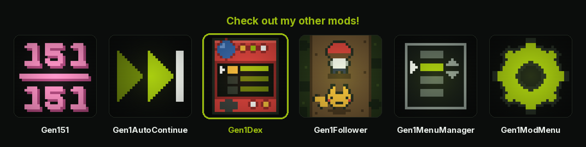

<p align="center">
  <a href="https://wild1walker.github.io/Gen1Wild/"></a>
</p>

<h1 align="center">Gen1Dex</h1>

<p align="center">
  <a href="https://wild1walker.github.io/Gen1Wild/"></a>
</p>

The Pokédex, brought up to the rest of the set — with a POKéMON beside every
entry.

A mod for [Gen1Recomp](https://github.com/bryanthaboi/gen1recomp).

---

## What it does

### A party icon beside every entry

The dex list draws each species' party icon in the margin to the left of its
row — the same icon the party menu draws, resolved down the same path, so a
menu-icon mod (`unique_menu_icons`, `new_icons`) shows up here for free.

**A species you have not discovered is a black silhouette.** Its shape is
there, its colours are not, and it fills back in the moment you see one.

Every discovered POKéMON on screen wears its own species colours — six palettes
at once, where the Game Boy could show four.

### Boxed like the rest of the set

Both screens carry a header box and a footer box, with the body ruled into
columns between them: on the list the icon column is ruled off from the names
and the owned ball sits in a fixed column of its own, so a column of balls
answers "what do I still need" at a glance. The list draws six rows rather than
the vanilla seven — the two boxes cost a tile row each end, and six 16-pixel
rows fill the 96 pixels between them exactly.

### Three ways to read the list

**SELECT** cycles the view:

| View | Shows |
| --- | --- |
| `POKéDEX` | every dex slot, in order, blanks included |
| `POKéDEX A-Z` | only what you have seen, sorted by name, dex numbers kept |
| `POKéDEX CAUGHT` | only what you own, in dex order |

A row of three pips in the header shows which view you are in. The cursor stays
on the same POKéMON wherever it survives the switch, and the `SEEN` / `OWN`
counts in the footer are the whole dex's in every view — they
count your Pokédex, not the filter you are looking through it with.

UP on the first row and DOWN on the last wrap to the other end.

### An entry is three pages

**LEFT** and **RIGHT** walk between them, wrapping both ways, and the two
arrows in the header say so. **B** closes.

1. **DEX** — the sprite, the kind, height and weight, and the Pokédex
   description. This is the vanilla page, kept.
2. **STATS** — the five base stats and their **BST**, the types, and what the
   species evolves into.
3. **MOVES** — the full movelist: level-up moves first, then TM/HM by machine
   number, paginated eight rows at a time.

**A** still advances too, because that is the key the vanilla page used. On the
DEX page it turns the description's own pages first, the way it did in the ROM,
and only moves on once the text is spent — but LEFT and RIGHT do not wait for
the text, because page three should not cost you reading page one.

On the first two pages **UP/DOWN** opens the previous or next species you have
seen, wrapping at both ends. On MOVES they page the list.

A move the species gets **STAB** on is marked with a chip in its own type's
colour, and each type on the STATS page is underlined in its own.

### The nickname prompt keeps that entry up

Catch a POKéMON the dex has never held and the game shows you its entry — and
then wipes the screen to white to ask whether you want to give it a nickname.
`AskName` clears the field before it prints, because the dex page and the
battle are two tilemaps and the Game Boy has one.

```
                    .-------.          .-------.
                    | >YES  |          | >YES  |
   (white)          |  NO   |    ->    |  NO   |  (the entry, still there)
                    '-------'          '-------'
.--------------------------.    .--------------------------.
| give a nickname          |    | give a nickname          |
| to VOLTORB?              |    | to VOLTORB?              |
'--------------------------'    '--------------------------'
```

The page stays up now. Same box, same words, same two rows in the corner — the
prompt is the engine's own and nothing about it moves; the only difference is
that the POKéMON you are being asked to name is on the screen while you name
it.

It is the **same screen**, not a second one built to look like it: a page you
left on STATS comes back on STATS, no cry plays twice, and no sprite is loaded
twice. The one thing put back is the species, because UP/DOWN on an entry walks
the ones you have seen and the box is about to ask after a particular POKéMON
by name.

### And a catch of something you already have keeps the battle

There is no dex page in that moment — the game never shows one for a species
the dex already holds — so the question is asked over the screen it *did*
interrupt: the field the POKéMON was caught on. Your POKéMON, both status
boxes, and the closed ball resting where the one you just caught was standing.

```
                    .-------.
                    | >YES  |     (o)  <- the ball, still where it landed
                    |  NO   |
                    '-------'
.--------------------------.
| give a nickname          |
| to ZUBAT?                |
'--------------------------'
```

That ball is the point. The Game Boy leaves it in OAM through the caught text
and only `AskName`'s `ClearSprites` takes it away — so keeping the field means
keeping the ball with it, and putting it down once you have answered is that
`ClearSprites`, moved to where the sprites are actually finished with.

Conjuring a dex page here was the obvious other answer and it is the wrong one:
a page you were never shown is not a page being *kept up*, and the twelfth
ZUBAT does not owe anyone its Pokédex paragraph.

`NAME IN PLACE` turns both halves off, and the prompt goes back to white.

### AREA, on a POKéMON you have never met

Vanilla's dex side menu returns early unless the entry is seen or owned, which
is exactly backwards on the screen a player opens to find out where something
lives. Pressing A on a blank row opens a two-row menu — `AREA` and `QUIT`, and
nothing that would hand over the dex paragraph you have not earned — and AREA
opens on the species that ROW names, which is what keeps it right in the A-Z
and CAUGHT views.

And the map it opens gets a line under it saying how to get there, for all 151.
The blinking nests say *where*; they cannot say *in the grass, around level
ten, and rare*, which is the half you actually need:

```
+--------------------+
|                    |
|      (Kanto, with  |
|    nests blinking) |
|                    |
|                    |
.--------------------.
| GRASS  Lv31-33     |
| UNCOMMON         . |
'--------------------'
```

It is read straight out of the live encounter tables — the map where the
species has the biggest share of the encounters, that map's own level band, and
a rarity worked out from Gen 1's ten slot buckets — so it is right by
construction and costs this mod no data of its own. None of it depends on
having caught the thing. A species that is wild nowhere falls back to the
evolution table: `EVOLVE ODDISH / AT LV21`, `LINK CABLE / ON KADABRA`, `MOON
STONE / ON NIDORINO`.

**And when nothing can answer, it says so** rather than leaving you looking at
an empty map:

```
.--------------------.
| NO RECORD REMAINS  |
| GO ADVENTURING!  . |
'--------------------'
```

That is what AREA on Articuno, Zapdos, Moltres or Mewtwo draws — the four
statics live in no wild table, so nobody has ever had a hint for them — and
what a mod's deliberately withheld species draws too. A blank screen cannot be
told apart from a broken one.

**The header is measured.** Vanilla writes `<NAME>'s NEST` or `<NAME> AREA
UNKNOWN` into a 19-column strip without checking either: `MOLTRES AREA UNKNOWN`
is 20 and ran off the right edge of the screen mid-word. The nest line is left
alone when it fits and shortened when it does not; the unknown line drops the
word AREA — the screen is already called AREA and the word was carrying nothing
— so it reads `MOLTRES UNKNOWN` and fits every name in the dex.

**A press takes it away, START brings it back.** The box covers two tile rows
of Kanto and one of them has nests in it, so the first A dismisses the hint and
the second closes the screen — which is what A always did. With the hint down
the screen is the plain town map again: the d-pad moves the cursor between
locations and the top strip names the one you are on, where vanilla's AREA
branch ignores the d-pad and stops drawing before either. B still leaves
immediately.

The box is four rows rather than the dialogue box's six. The dialogue box
double-spaces its lines because it is typing a story at you with nothing behind
it; this is a two-line label over a map, and the sixteen pixels that buys back
are two whole tile rows of Kanto.

### Another mod can write that line

A mod that ADDS a spawn knows things the encounter tables cannot carry — the
tier it rolled the spawn at, the HM the map needs, whether the spawn is behind
an event that has not fired yet. So it can hand this screen the words instead:

```lua
local dex = mod.find("Gen1Dex")
if dex and dex.exports.area then
  dex.exports.area.provide(function(game, species)
    if species ~= "SCYTHER" then return nil end        -- no opinion
    return { "SUPER ROD  Lv15-25", "VERY RARE" }       -- draw these
  end, mod.id)
end
```

Return two lines to draw them, `false` to withhold an answer the built-in
readings must not fill in for, or `nil` to pass. Providers are asked in
registration order, the first opinion wins, and the readings above are last, so
a mod's answer for a species always outranks the generic one. The second
argument is your mod id: pass it and a hot reload replaces your provider rather
than stacking a second one closed over the previous load's tables.

A withheld species gets the `NO RECORD REMAINS` line above — the same one a
legendary gets. That is deliberate: a seal that read differently from an
ordinary blank would tell the player there is something there, which is the
one thing a seal exists not to say.

[Gen151](https://github.com/wild1walker/Gen151) is the first user of it — it
captions every spawn it places, and withholds MEW's until the Mansion journals
have been read, so MEW's screen and Moltres's read exactly alike until then.

### The START menu says DEX

The overworld START menu's first row reads `DEX` rather than `POKéDEX`. The row
is the engine's own — same place in the list, same key, same screen behind it —
and nothing else that says POKéDEX moves: the SAVE panel still counts your
`POKéDEX`, and the list header still names the view you are in.

`START SAYS DEX` turns it off, and the row goes back to the word the cart used.

---

## Options

In the mod manager:

| Option | Default | What it does |
| --- | --- | --- |
| `SPECIES COLOURS` | ON | Every POKéMON in its own colours over a grey ramp. Off restores the vanilla dex brown and asks for no palette zones at all. |
| `SELECT VIEWS` | ON | SELECT cycles numbered / A-Z / caught. |
| `UP/DOWN SPECIES` | ON | UP/DOWN on an entry walks the species you have seen. |
| `LIST WRAPS` | ON | UP on the first row crosses to the last, and back. |
| `HOLD TO SCROLL` | ON | Hold a direction on the list to keep moving. |
| `START SAYS DEX` | ON | The overworld START menu's dex row reads `DEX`. Off leaves the engine's `POKéDEX` row alone. |
| `AREA ON UNSEEN` | ON | A on an entry you have never met opens `AREA` / `QUIT`. Off hands that press back to the engine, which does nothing with it. |
| `AREA HINTS` | ON | The line under the AREA map. Off leaves that screen exactly as the cartridge drew it — and takes the caption away from any mod that registered one. |
| `NAME IN PLACE` | ON | The nickname prompt after a catch keeps the screen it interrupted — the dex entry for a species the dex has never held, the battle for anything else. Off asks the question over the blank white field `AskName` wipes to. |

---

## Install

Download `Gen1Dex-<version>.zip` from
[Releases](https://github.com/wild1walker/Gen1Dex/releases) and install it from
the game: **MODS → Import mod .zip**.

---

## How it works

Two registered screen replacements and one renamed START menu row.
`Screens.resolve` prefers
the screens registry over the builtin module, so a mod-free boot is untouched
and a factory that throws degrades to the builtin — which is why every entry
point in `main.lua` is guarded rather than trusted. A Pokédex that fails to
open is worse than a vanilla one.

- **`PokedexMenu`** is built by the *vanilla* constructor and then re-dressed.
  That keeps the `DATA` / `CRY` / `AREA` / `QUIT` side menu, the cursor memory
  and the `QUIT` path exactly as they were: this mod has an opinion about how
  the list looks and which entries are in it, and none at all about what
  pressing A on one does.
- **`DexEntryMenu`** is a screen of its own, because its first page has to be
  the vanilla page and its other two have to share that page's frame.
- **`TownMap`** is the one engine screen this mod reaches for directly — it has
  no hook on it, and the AREA caption has to go somewhere. It is not replaced:
  `TownMap.new` is wrapped, the original called, and the caption installed as
  instance fields over the screen it built, so the engine's own `draw` and
  `update` run untouched underneath. This is what the `engine_internals`
  permission — the **PATCHES ENGINE CODE** badge in the manager — is for.
- **`BattleState.askNicknameUI`** is the second, and is reached for the same
  way and for the same reason: it has no hook either, and the prompt after a
  catch is the one place the dex entry has to survive a screen it does not own.
  The two backdrops cost different things — the entry is *drawn*, over the
  white field the engine has already painted, so a page that throws leaves
  exactly the screen the cartridge drew; the battle is not drawn by anything
  here at all, it is one boolean (`blankForAskName`, the engine's own "wipe the
  field for AskName") saying *don't*.
  The method is not replaced — the original is called, the box it built is the
  box that is returned, and the backdrop is installed as instance fields over
  it. Nothing is pushed on the state stack and nothing is popped off it: a
  battle's queue waits on being the top of the stack again, so a screen of this
  mod's own left sitting under the prompt would be a battle that never
  resumes. A backdrop is worth a great deal less than that.
- **The START menu row** is renamed through the engine's `ui.start_menu.items`
  hook, which every built row runs past before the menu opens. The hook calls
  downstream first and then renames what comes back, so a row another mod
  inserted survives, and only the label changes — the row keeps its position,
  its key and its `onSelect`. It is matched on the looked-up label rather than
  on the English literal, so a translation mod's row is still the row that gets
  renamed, and the new label is looked up too.

### The silhouette is a tint, not a palette

`PartyMenu.drawIcon` never sets a colour of its own — it draws in the
caller's, and LÖVE multiplies the image by it. So `setColor(0,0,0,1)` takes
every pixel's RGB to zero and leaves its alpha alone: a silhouette of the exact
shape the icon draws, for free.

The palette route cannot do this job. A zone of four blacks would blacken a DMG
icon, but an icon mod's authored full-colour art is re-blit *unshaded* over the
colourised pass, so it would come back in colour underneath — the one entry you
have never met would be the only one on screen in full colour. A tint is
applied at draw time, before any of that, and holds for both kinds of art.

### The sprite well scales rather than clips

A Gen 1 front sprite is at most 56×56 and the well is exactly that — but nothing
*guarantees* it. `HGSS_SPRITES`, `Gold_Silver_Sprites` and the Crystal animation
frames ship whatever art their authors drew, and a 96×96 one drawn at 1:1 ran 38
pixels past the bottom of the well, through the rule and across all three lines
of the description. Oversized art is now scaled down by the tighter of the two
ratios, keeping its aspect; art that already fits is never scaled *up*, because
a 32-pixel sprite blown up to 56 is a blurry 32-pixel sprite. Whatever is left is
centred in both axes — a picture pinned to the floor of a well it does not fill
leaves all of its slack in one stripe above it.

The palette zone and the true-colour mark are measured from the **drawn** rect,
not the file's, or a scaled sprite would re-blit a patch bigger than the picture.

### The geometry is in whole tiles

An SGB palette zone is *addressed* in tiles, so an icon that is not on a tile
boundary cannot carry one. The icons sit at `x = 8` on a 16-pixel pitch from
`y = 24`, which is the vanilla list's own row pitch — the icons fit the list
rather than the list moving to fit the icons.

### The type colours are not palette colours

The SGB pass remaps every pixel to one of four palette entries keyed off its
**red** channel, so a colour drawn straight onto the screen does not come out as
itself — GRASS green lands on shade 2 and is painted the palette's dark grey.
Every type would end up a different grey, which looks like a bug. The type rules
and STAB chips are marked with `PaletteFX.markTrueColor` instead, so they are
re-blit with no shader and survive exactly as drawn.

---

## Differences from `useful_dex`

Gen1Dex covers everything
[useful_dex](https://github.com/ShaneMcGovernIE/useful_dex) does — the stats /
BST / evolutions page, the full movelist, and the three list views — and the two
mods take the same two screen ids, so they **conflict** and only one can be
installed.

What is different here:

- **The Pokédex description is still there.** `useful_dex` replaces the vanilla
  entry page outright and its description goes with it. Here the vanilla page
  *is* the first page, and A walks its text before moving on.
- **Party icons in the list**, blacked out until discovered — the feature this
  mod exists for.
- **Framed pages.** A shared header and footer box on all three entry pages, so
  three pages read as one screen with three faces rather than as three screens.
- **LEFT/RIGHT page navigation**, with arrows in the header. `useful_dex` cycles
  on A only, so overshooting a page means going forward twice to get back.
- **Oversized sprite packs do not overflow the page.**
- **Type colour survives the palette pass.** `useful_dex` draws its STAB chips
  as plain colour, which the SGB shade remap turns into an arbitrary grey.
- **Per-species palette zones** on the list and the entry sprite.
- **Options**, so every part of it can be turned off.

---

## Known limits

- **`useful_dex` and `pokedex_plus` are declared conflicts.** All three
  register the same screen ids; the last one loaded would win silently.
- **A species with several evolutions loses the method labels.** One evolution
  gets two lines — how, then into what. Two or three (EEVEE) get one line each
  and just the name: the column is ten glyphs wide, `LEVEL 16 IVYSAUR` is
  sixteen, and three rows is all that fits. Which POKéMON it becomes is the
  answer the dex is being asked for; the methods are still written on the
  stones in your bag.
- **No stat bars on the STATS page.** A bar wide enough to read costs 24
  pixels, and taking them from the right column truncates `CHARMELEON`. A
  number you can compare is worth more than a bar you cannot read.
- **The list draws six rows, not the vanilla seven.** The header and footer
  boxes cost a tile row each end. The icons were sized to the vanilla 16-pixel
  pitch rather than the pitch growing to fit them.

---

## Testing

The suite runs headlessly against a Gen1Recomp checkout, with no ROM: it loads
the mod through the production `Loader`, merges it into the ROM-free fixture
dataset, and drives both screens.

```sh
# from a Gen1Recomp checkout, with this mod at mods/Gen1Dex
luajit mods/Gen1Dex/tests/gen1dex_test.lua

# the AREA surface: the caption, the presses, the d-pad, the provider hook
luajit mods/Gen1Dex/tests/area_test.lua
```

`GEN1DEX_DIR` overrides where the mod is read from. CI runs the same command on
every push and pull request (`.github/workflows/test.yml`).

## Releasing

Push to `main` and `.github/workflows/release.yml` packs the mod into an
installable `.zip` and publishes it as a GitHub Release, once per push.

The version is resolved by the first rule that applies:

1. the `version` input of a manual **Run workflow**,
2. `[release X.Y.Z]` anywhere in the commit message,
3. `manifest.json`'s own version, when it is ahead of every existing tag — so
   **bumping the manifest is the normal way to cut a release**,
4. otherwise the newest `vX.Y.Z` tag with its patch incremented.

Whichever wins is written into the `manifest.json` inside the archive, so a
shipped mod never reports a different version than the release it came from.
The job refuses to clobber an existing tag or release.

## Credits

By **Wild**.

Built on the screen, palette and registry seams of [Pokemon Gen1Recomp](https://github.com/bryanthaboi/gen1recomp), and on the
[pret](https://github.com/pret) disassembly of Pokemon Red, Blue and Yellow -- `home/text.asm` is where
the text box this mod draws into is defined.

**[useful_dex](https://github.com/ShaneMcGovernIE/useful_dex)**, by
ShaneMcGovernIE, got to this ground first: the stats page, the movelist and the
three list views were all there before they were here. This mod takes none of
its code -- the two conflict rather than share -- but the section above
comparing the two exists because that mod set the bar it is measured against,
and prior art deserves saying out loud rather than only being differed from.

The optional art this mod draws when it is installed belongs to the people who
made it: `unique_menu_icons` and `new_icons` for the party icons in the list,
and the HGSS, Gold/Silver, Crystal and
`crystal_animated_sprites_with_shiny_visuals` packs for the entry sprites.
Nothing from any of them is vendored here -- the mod resolves through whatever
is installed and falls back to the cartridge's own art.

## Licence

MIT — see [LICENSE](LICENSE).
